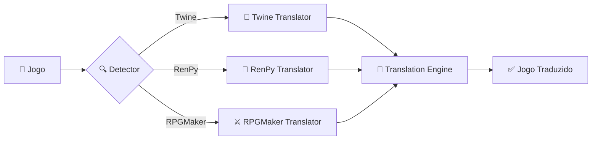
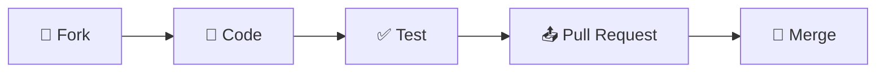

<div align="center">

# 🎮 Game Translator

### Tradução Automática de Jogos Multi-Engine

[](https://www.python.org/)
[](https://flask.palletsprojects.com/)
[](LICENSE)

**Traduza jogos Twine, RenPy e RPGMaker de forma rápida e eficiente**

[Características](#-características) • [Instalação](#-instalação) • [Uso](#-uso) • [Documentação](#-documentação)

---

</div>

## 📸 Preview

<div align="center">

### Interface Web Moderna


*Interface web limpa e intuitiva com tema dark mode*

</div>

## ✨ Características

<table>
<tr>
<td width="50%">

### 🎯 Multi-Engine
Suporte completo para:
- 🎲 Twine/SugarCube
- 💬 RenPy
- ⚔️ RPGMaker MV/MZ

</td>
<td width="50%">

### 🌍 Multi-Idioma
10 idiomas suportados:
- 🇬🇧 English • 🇧🇷 Português
- 🇪🇸 Español • 🇫🇷 Français
- 🇩🇪 Deutsch • 🇮🇹 Italiano
- 🇷🇺 Русский • 🇯🇵 日本語
- 🇨🇳 中文 • 🇰🇷 한국어

</td>
</tr>
<tr>
<td width="50%">

### 🖥️ Interfaces Flexíveis
- 🌐 **Web UI** - Moderna e responsiva
- 🖼️ **Desktop GUI** - CustomTkinter
- ⌨️ **CLI** - Para automação

</td>
<td width="50%">

### ⚡ Performance
- 📦 Tradução em lote
- 💾 Sistema de cache
- 🔄 Retomada automática
- 🤖 Detecção automática

</td>
</tr>
</table>

## 🚀 Instalação

### Pré-requisitos

```bash
Python 3.8+
pip ou uv
```

### Quick Start

<table>
<tr>
<td width="33%" align="center">

#### 1️⃣ Clone
```bash
git clone <repo>
cd Game-Translator
```

</td>
<td width="33%" align="center">

#### 2️⃣ Instale
```bash
pip install -r requirements.txt
```

</td>
<td width="33%" align="center">

#### 3️⃣ Execute
```bash
python3 gui_web.py
```

</td>
</tr>
</table>

### Instalação Detalhada

<details>
<summary><b>🐧 Linux / 🍎 macOS</b></summary>

```bash
# Clone o repositório
git clone <url-do-repositorio>
cd Game-Translator

# Crie ambiente virtual
python3 -m venv venv
source venv/bin/activate

# Instale dependências
pip install -r requirements.txt

# Baixe modelo de tradução
python3 translate.py --install-model

# Inicie a interface web
./start.sh
```

</details>

<details>
<summary><b>🪟 Windows</b></summary>

```bash
# Clone o repositório
git clone <url-do-repositorio>
cd Game-Translator

# Crie ambiente virtual
python -m venv venv
venv\Scripts\activate

# Instale dependências
pip install -r requirements.txt

# Baixe modelo de tradução
python translate.py --install-model

# Inicie a interface web
start.bat
```

</details>

## 💻 Uso

### Interface Web (Recomendado)

```bash
python3 gui_web.py
```

> 🌐 Abre automaticamente em `http://localhost:7321`

<div align="center">

| Passo | Ação |
|:-----:|------|
| 1️⃣ | Selecione a pasta ou arquivo do jogo |
| 2️⃣ | Escolha os idiomas (origem → destino) |
| 3️⃣ | Clique em "Start Translation" |
| 4️⃣ | Aguarde o processamento |
| 5️⃣ | Arquivo traduzido será gerado automaticamente |

</div>

### Interface Desktop

```bash
python3 gui.py
```

<div align="center">


</div>

### Linha de Comando

```bash
# Tradução básica
python3 translate.py jogo.html

# Com opções avançadas
python3 translate.py jogo.html --batch 20 --resume
```

#### Opções CLI

| Opção | Descrição | Padrão |
|-------|-----------|--------|
| `--batch N` | Textos por lote | 20 |
| `--resume` | Continua tradução interrompida | - |
| `--install-model` | Baixa modelo de tradução | - |

## 🔧 Como Funciona

<div align="center">



</div>

### 🎲 Twine/SugarCube

```
1. Extrai passagens do HTML
2. Identifica textos traduzíveis
3. Preserva código e variáveis
4. Traduz em lotes
5. Gera *-ptbr.html
```

### 💬 RenPy

```
1. Detecta arquivos .rpy
2. Extrai diálogos e textos
3. Cria arquivos de tradução
4. Mantém estrutura original
```

### ⚔️ RPGMaker MV/MZ

```
1. Processa arquivos JSON
2. Traduz diálogos, itens, habilidades
3. Preserva estrutura de dados
4. Gera versão traduzida
```

## 📁 Estrutura do Projeto

```
Game-Translator/
│
├── 🌐 gui_web.py              # Interface web (Flask)
├── 🖼️  gui.py                  # Interface desktop (CustomTkinter)
├── ⌨️  translate.py            # CLI para Twine
├── 📋 requirements.txt        # Dependências Python
├── 🚀 start.sh / start.bat    # Scripts de inicialização
│
├── 📂 templates/
│   └── index.html             # Interface web HTML
│
└── 📂 translators/
    ├── base.py                # Classe base
    ├── detector.py            # Detecção automática
    ├── engine.py              # Motor de tradução
    ├── twine.py               # Tradutor Twine
    ├── renpy.py               # Tradutor RenPy
    └── rpgmaker.py            # Tradutor RPGMaker
```

## 📚 Exemplos de Uso

### Exemplo 1: Traduzir Jogo Twine

```bash
# Tradução simples
python3 translate.py meu-jogo.html

# Resultado: meu-jogo-ptbr.html
```

<details>
<summary>Ver output esperado</summary>

```
Lendo meu-jogo.html...
  42 passagens encontradas.
  1.247 textos únicos extraídos.
  1.247 textos para traduzir...

  Lote 1/63... OK  (20/1247)
  Lote 2/63... OK  (40/1247)
  ...
  Lote 63/63... OK  (1247/1247)

Aplicando traduções...
Pronto! 1247/1247 textos traduzidos.
Arquivo gerado: meu-jogo-ptbr.html
```

</details>

### Exemplo 2: Traduzir Jogo RenPy

<table>
<tr>
<td width="50%">

**Via Interface Web:**

1. Abra `http://localhost:7321`
2. Clique em 📁 (pasta)
3. Selecione pasta do jogo
4. Configure: EN → PT
5. Start Translation

</td>
<td width="50%">

**Via Interface Desktop:**

1. Execute `python3 gui.py`
2. Clique em "Pasta"
3. Selecione diretório
4. Ajuste configurações
5. "Traduzir Agora"

</td>
</tr>
</table>

### Exemplo 3: Traduzir RPGMaker com Cache

```bash
# Primeira execução (interrompida)
python3 gui_web.py
# ... tradução interrompida em 45% ...

# Retomar tradução
python3 gui_web.py
# Carrega cache e continua de onde parou
```

## 💾 Cache e Retomada

O sistema cria arquivos `.traducoes.json` automaticamente:

<div align="center">

| Recurso | Descrição |
|---------|-----------|
| 💾 **Auto-save** | Salva progresso a cada lote |
| 🔄 **Retomada** | Continue de onde parou |
| 📊 **Estatísticas** | Acompanhe textos traduzidos |
| 🗑️ **Limpeza** | Delete cache para recomeçar |

</div>

```bash
# Estrutura do cache
{
  "texts": {
    "Hello World": "Olá Mundo",
    "Start Game": "Iniciar Jogo",
    "Continue": "Continuar",
    ...
  }
}
```

## 🐛 Solução de Problemas

<details>
<summary><b>❌ Modelo não encontrado</b></summary>

```bash
python3 translate.py --install-model
```

Isso baixará o modelo de tradução EN→PT necessário.

</details>

<details>
<summary><b>❌ Erro de dependências</b></summary>

```bash
# Atualize pip
pip install --upgrade pip

# Reinstale dependências
pip install --upgrade -r requirements.txt
```

</details>

<details>
<summary><b>❌ Interface web não abre</b></summary>

1. Verifique se a porta 7321 está livre:
```bash
lsof -i :7321  # Linux/Mac
netstat -ano | findstr :7321  # Windows
```

2. Acesse manualmente: `http://localhost:7321`

3. Tente outra porta editando `gui_web.py`:
```python
port = 8080  # Mude para porta disponível
```

</details>

<details>
<summary><b>❌ Tradução incompleta</b></summary>

O sistema salva progresso automaticamente. Apenas execute novamente:

```bash
python3 translate.py jogo.html --resume
```

Ou use a interface web/desktop normalmente.

</details>

<details>
<summary><b>❌ Erro de memória</b></summary>

Reduza o tamanho do lote:

```bash
python3 translate.py jogo.html --batch 10
```

</details>

### 📞 Precisa de Ajuda?

- 🐛 [Reporte bugs](../../issues)
- 💡 [Sugira features](../../issues)
- 📖 [Veja a wiki](../../wiki)
- 💬 [Discussões](../../discussions)

## 🛠️ Tecnologias

<div align="center">

| Tecnologia | Uso | Versão |
|:----------:|-----|:------:|
|  | Linguagem principal | 3.8+ |
|  | Framework web | Latest |
|  | Interface desktop | Latest |
|  | Motor de tradução offline | Latest |
|  | Aceleração de inferência | Latest |

</div>

### Stack Completo

```yaml
Backend:
  - argostranslate: Motor de tradução offline
  - ctranslate2: Aceleração de inferência
  - sentencepiece: Tokenização
  - sacremoses: Pré-processamento

Frontend:
  - Flask: Servidor web
  - HTML5/CSS3: Interface moderna
  - JavaScript: Interatividade
  - Phosphor Icons: Ícones

Desktop:
  - CustomTkinter: UI moderna
  - Threading: Processamento assíncrono

Utilities:
  - unrpa: Extração RenPy
  - numpy: Operações numéricas
```

## ⚠️ Limitações

<div align="center">

| Aspecto | Detalhes |
|---------|----------|
| 🌐 **Conexão** | Tradução offline (não requer internet após instalação) |
| 🎯 **Qualidade** | Varia conforme complexidade do texto |
| 🔧 **Revisão** | Pode precisar ajustes manuais em código complexo |
| 🎮 **Compatibilidade** | Algumas estruturas de jogo podem não ser suportadas |
| 💾 **Memória** | Jogos muito grandes podem precisar de mais RAM |

</div>

## 🤝 Contribuindo

Contribuições são muito bem-vindas! 

<div align="center">

### Como Contribuir



</div>

**Você pode:**

- 🐛 Reportar bugs
- 💡 Sugerir novos recursos
- 🎮 Adicionar suporte para outros engines
- 🌍 Melhorar traduções
- 📖 Melhorar documentação
- 🎨 Aprimorar interfaces

### Diretrizes

1. Fork o projeto
2. Crie uma branch (`git checkout -b feature/NovaFeature`)
3. Commit suas mudanças (`git commit -m 'Add: Nova feature'`)
4. Push para a branch (`git push origin feature/NovaFeature`)
5. Abra um Pull Request

## 📊 Roadmap

- [ ] Suporte para mais engines (Unity, Godot)
- [ ] Tradução em tempo real
- [ ] API REST
- [ ] Docker container
- [ ] Suporte para mais idiomas
- [ ] Interface mobile
- [ ] Integração com serviços de tradução online
- [ ] Sistema de plugins

## 📄 Licença

Este projeto está sob a licença MIT. Veja o arquivo [LICENSE](LICENSE) para mais detalhes.

## 👤 Autor

Desenvolvido com ❤️ por [Seu Nome]

<div align="center">

### ⭐ Se este projeto foi útil, considere dar uma estrela!

[](../../stargazers)
[](../../network/members)

---

**[⬆ Voltar ao topo](#-game-translator)**

</div>
